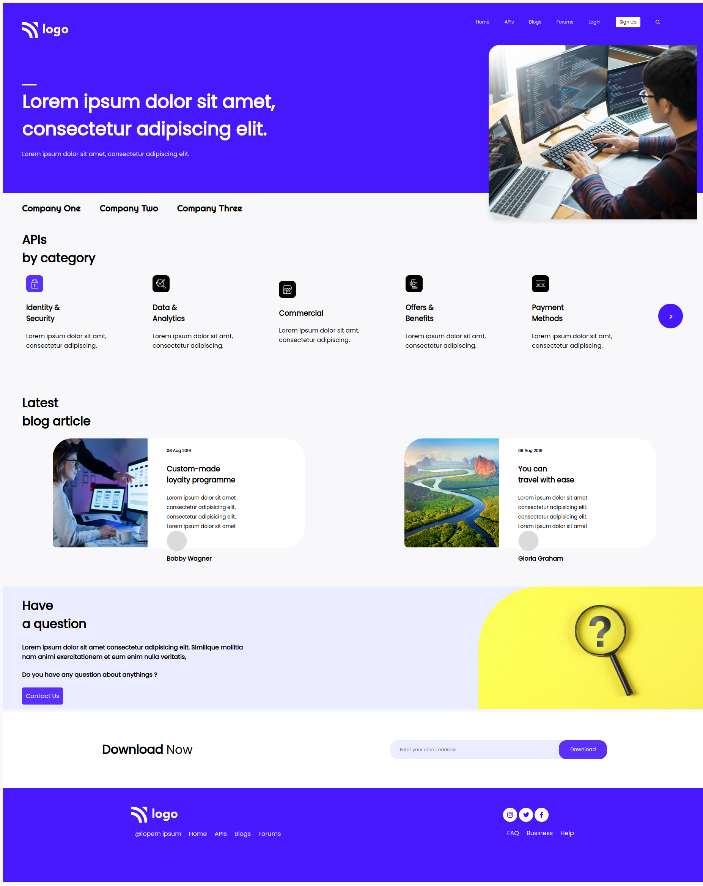

## JSFS (Project 9)
---

Hi

This is a FSJS Live Class Project No. 9 Repo. In this project I have worked hard and achive it to create all section. I have got to learn and used many awesome css properies like - flex, position, selectors and properties.

I would like to say Thankyou my instructor `Hitesh Choudhary` for the guiding, mentoring and pushing me hard so that I can learn and develop this project.

### Stack Used :
---

### Live Link :

> [Live Url](https://rajendra-project-9.netlify.app/)

### Mockups
---

 